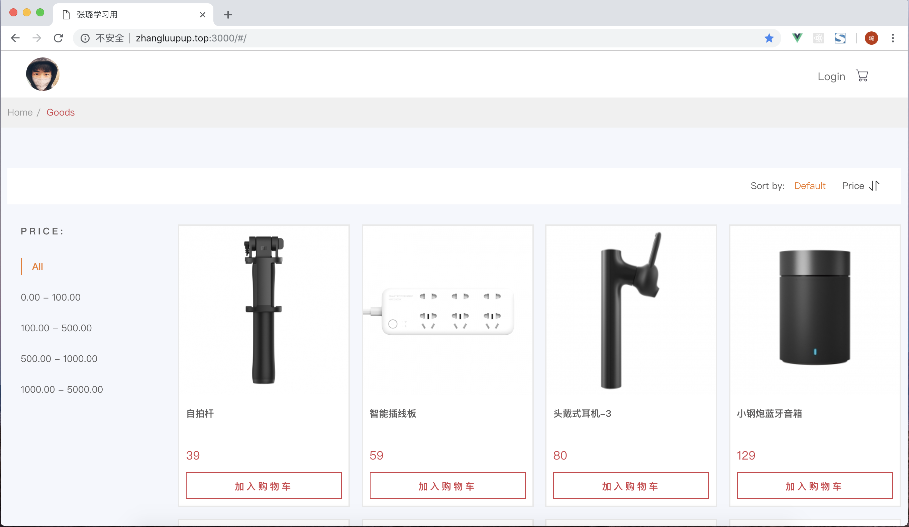
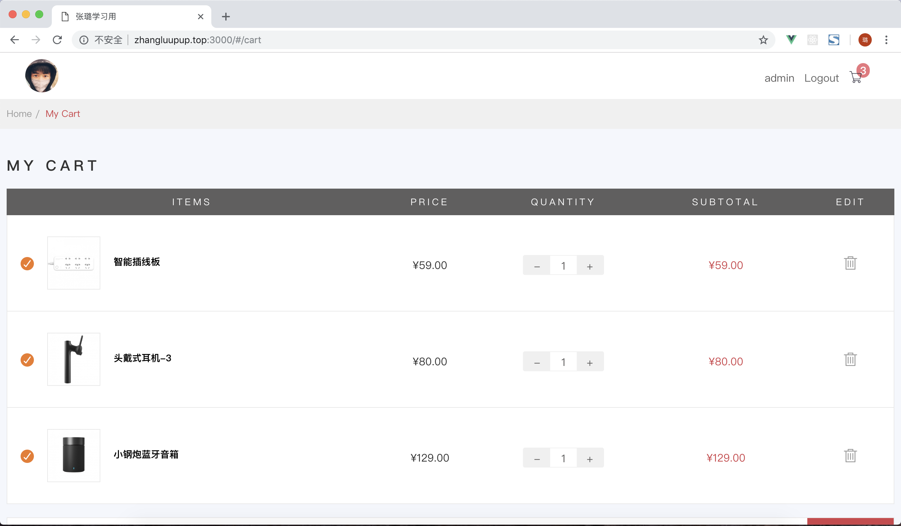
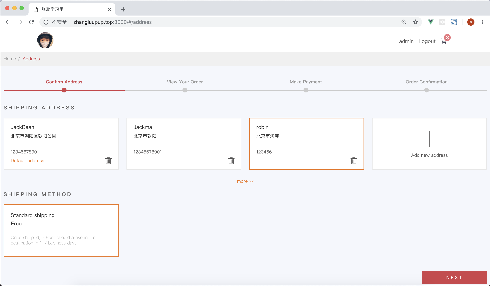
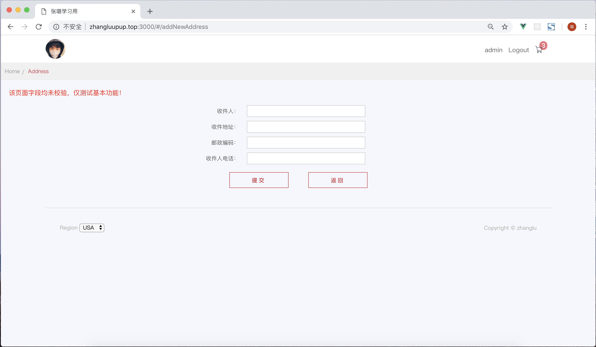
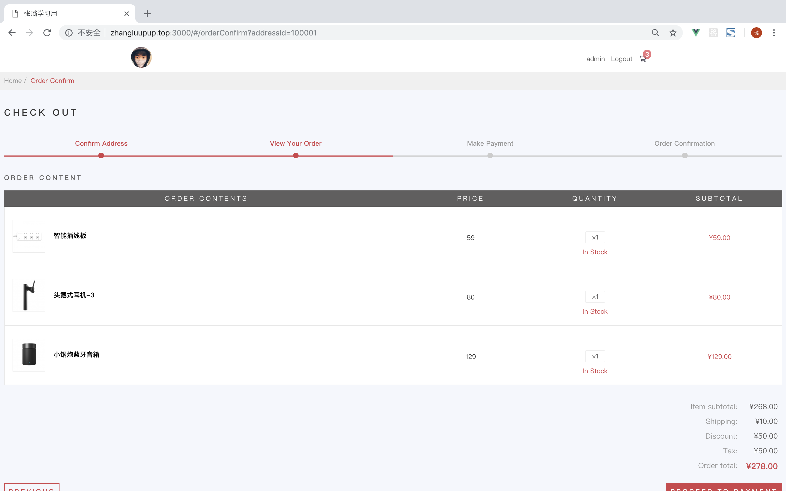
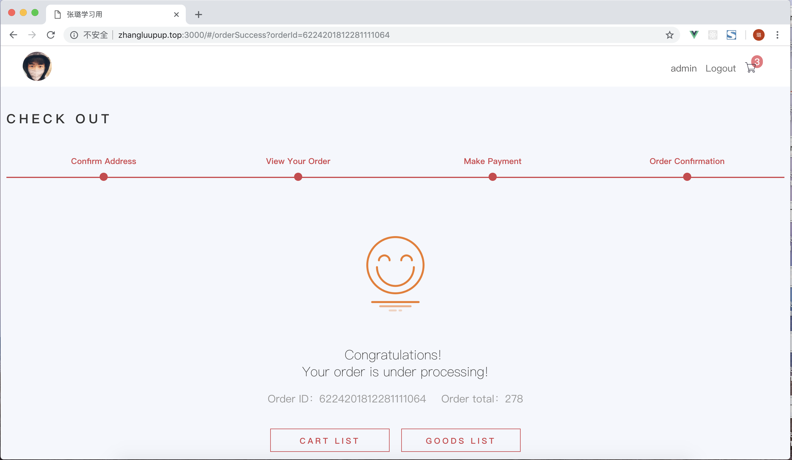

# vue2-demo

##### 从零开始构建一个简单的购物商城项目
> 使用 vue2 + vue-router + vuex + VueResource/axios 进行相关代码开发

## Build Setup

``` bash
# install dependencies
npm install

# serve with hot reload at localhost:8080
npm run dev

# build for production with minification
npm run build

# build for production and view the bundle analyzer report
npm run build --report
```
代码这块就暂时告一段落了，目前在折腾服务器，有点头疼。。。

* 2018/12/21
    http://zhangluupup.top:3000/#/   热烈庆祝该个人项目上线，开心:smile:smile:smile:smile:smile

* 2018/01/07
    网站截图
    
    
    
    
    
    


For a detailed explanation on how things work, check out the [guide](http://vuejs-templates.github.io/webpack/) and [docs for vue-loader](http://vuejs.github.io/vue-loader).
